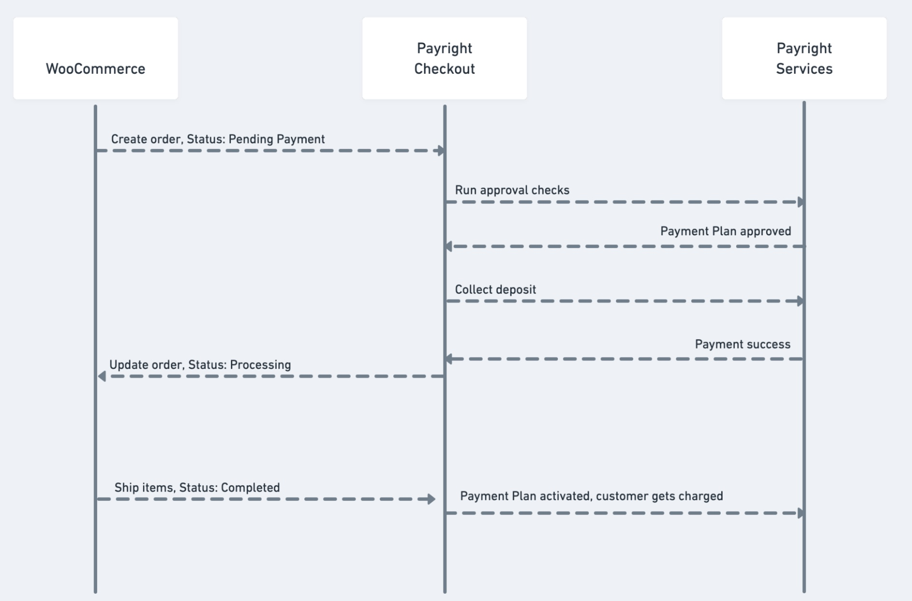
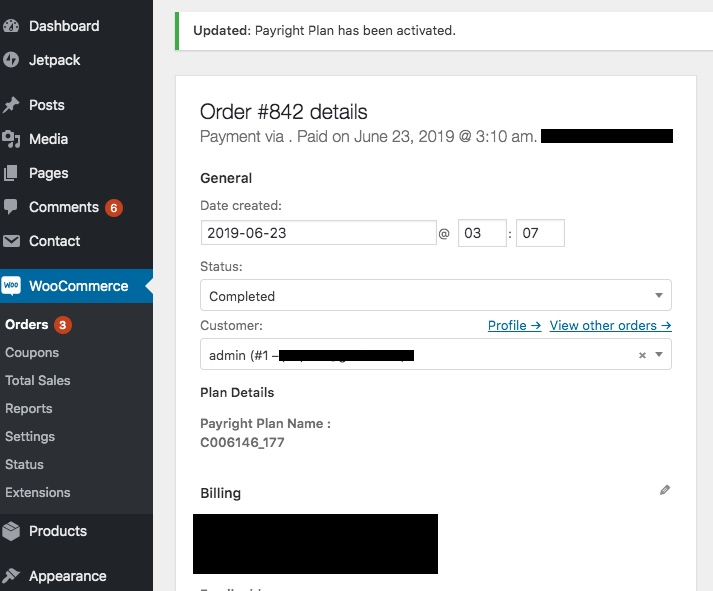

## payright-woocommerce

The Payright plugin for WooCommerce.

Give your customers the option to pay in convenient zero-interest instalments.

Payright helps turn ‘too much’ into ‘too easy’ by spreading the cost of purchases over time. The "Payright" plugin provides the option to choose Payright as the payment method at the checkout. 

It also provides the functionality to display the Payright logo and instalment calculations below product prices on category pages, individual product pages, home pages and on the checkout page. For each payment that is approved by Payright, an order will be created inside the WooCommerce system like any other order. Payright plans will activate once a product is shipped.

Please follow the steps below for setup, installation and configuration.

### Installation
This section outlines the steps to install the Payright plugin for the first time.

#### Requirements
+ Access Token - A 'sandbox access token', or 'production access token'.
+ Wordpress - Minimum version 5.6.x
+ WooCommerce Minimum version 5.2.x

#### How to install

1. Download the 'payright-woocommerce' plugin.
2. Navigate to the "Add New" in the 'Plugins' dashboard.
2. Navigate to the "Upload" area.
3. Select the 'payright-woocommerce' .zip file from your computer.
4. Click "Install Now".
5. Activate the plugin in the 'Plugin' dashboard.

### Configuration - WooCommerce
Payright operates under assumptions based on Wordpress configurations. To align with these assumptions, the Wordpress configurations must reflect the below.

1. Store 'Country' set to 'Australia' or 'New Zealand'.
2. Store 'Currency' set to 'AUD' or 'NZD', according to 'Country'.
3. WooCommerce installed.

### How does it work

#### Checkout with Payright
A checkout processed by the Payright payment method, follows the checkout flow shown 
in the diagram below:

#### Activate Payright plan with order shipment
1. When a customer returns after payment through Payright, the payment status will be set as 'processing'. 
1. Once the order is shipped the payment status will be "Complete".  
1. On the order details page > Change status to Complete. 
1. Once the shipment is completed the plan will be Activated.

The plan is activated when the order is shipped. 
If the plan is successfully activated a notification will be displayed (as shown) 
that the plan has been activated.

To further manage your customer's Payright plans, log in with your Payright merchant account
at the Merchant Portal (https://merchant.payright.com.au/).

> If there is an issue with the plan activation, please contact support@payright.com.au.

#### Pre-requisite Plugin Configuration
Complete the below steps to configure your Payright plugin:

1. Go to plugins page and click 'Configure'.
2. Define your 'Access Token'.
3. Select your 'Region / Country', 'Australia' or 'New Zealand'.
4. Check 'Enable Payright' checkbox.
5. Set the Payright plugin mode, toggling the 'Enable Sandbox Mode' checkbox:
    + Check 'Enable Sandbox Mode' for testing on a staging instance.
    + Uncheck 'Enable Sandbox Mode' for a live store and legitimate transactions.
6. Click 'Save Changes'.

#### Optional Configuration
1. Navigate to WooCommerce > Settings > Payments.
2. 'Enable Payright' and click on the 'Manage' button under 'Payment' for Payright.
3. Configure the display of the Payright installments details on:
    + Product Pages (Recommended)
    + Catalogue Pages (Recommended)
    + Related Products (Optional)
    + Front Page (Optional)
3. Enter a 'Minimum Amount' to display the installments.

#### Resource Links
1. Developer Portal - https://developers.payright.com.au
1. Merchant Portal - https://merchant.payright.com.au
1. Marketing Kit - https://payright.com.au/im-a-business/resources/integration-resources